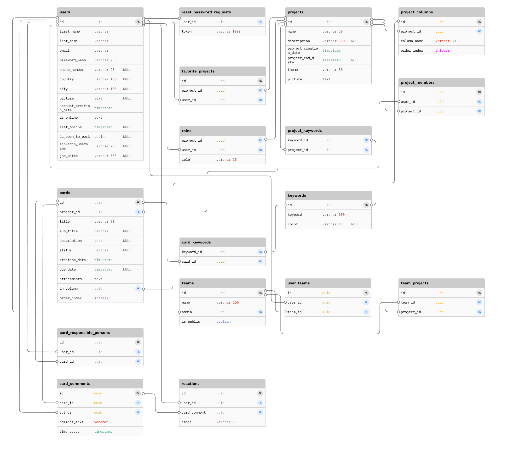

## Backend

### Backend technologies and their applications

**TypeScript**

Our server code is implemented using node.js and TypeScript. Project’s endpoints with RESTful APIs are implemented using the [express framework](https://expressjs.com/). Various other packages are used in the server logic, such as [uuid](https://www.npmjs.com/package/uuid) for creating unique identifiers for users and projects, [nodemailer](https://www.nodemailer.com/) for sending reset password links via email and [jsonwebtoken](https://www.npmjs.com/package/jsonwebtoken) for creating tokens.

**PostgreSQL**

Kanvas’ database is implemented in PostgreSQL. The database consists of total 17 tables, two of which are base tables (in this case, tables with no foreign key constraints) and 15 of which are dependent tables (i.e., tables with foreign key constraints).

Base tables:

| Table name | Description  | Columns (NN = not null)                                                                                                                                                                                                                                                                                                                                                                                                                    |
| ---------- | ------------ | ------------------------------------------------------------------------------------------------------------------------------------------------------------------------------------------------------------------------------------------------------------------------------------------------------------------------------------------------------------------------------------------------------------------------------------------ |
| `projects` | project data | id (uuid) NN   name (varchar 50) NN   description (varchar 500)   is_public (boolean) NN   project_creation_date (timestamp) NN   project_end_date (timestamp)  theme (varchar 50)   picture (text)                                                                                                                                                                                                                   |
| `users`    | user data    | id (uuid) NN   first_name (varchar) NN   last_name (varchar) NN   email (varchar) NN   password_hash (varchar 255) NN   phone_number (varchar 20)   country (varchar 100)   city (varchar 100)   picture (text)   account_creation_date (timestamp) NN   is_online (boolean) NN   last_online (timestamp)   is_open_to_work (boolean)   linkedin_username (varchar 29)   job_pitch (varchar 500) |

Dependent tables:
| Table name | Description | Columns (NN = not null) |
|-|-|-|
| `card_comments` | comment data in kanban cards | id (uuid) NN  card_id (uuid) NN  author (uuid) NN  comment_text (varchar) NN  time_added (timestamp) NN |
| `card_keywords` | keywords assigned to a card | keyword_id (uuid) NN   card_id (uuid) NN |
| `card_responsible_persons` | responsible persons assigned to a card | id (uuid) NN   user_id (uuid) NN   card_id (uuid) NN |
| `cards` | cards (tasks) that belong to column in Kanban board | id (uuid) NN  project_id (uuid) NN  title (varchar 50) NN  sub_title (varchar)  description (text)  status (varchar)  creation_date (timestamp) NN  due_date (timestamp)  attachments (text)  in_column (uuid) NN  order_index (integer) NN   |
|`favorite_projects`| favorite projects of a user | id (uuid) NN   project_id (uuid) NN   user_id (uuid) NN |
|`keywords`| keywords (labels) used in cards and projects | id (uuid) NN   keyword (varchar 100) NN   color (varchar 10) |
|`project_columns`| columns (lists) that belong to project in Kanban board | id (uuid) NN   project_id (uuid) NN   column_name (varchar 50) NN   order_index (integer) NN |
|`project_keywords`| keywords (labels) assigned to a project | keyword_id (uuid) NN   project_id (uuid) NN |
|`project_members`| members participating in a project | id (uuid) NN   user_id (uuid) NN   project_id (uuid) NN |
|`reactions`| emoji reactions in a card comment | id (uuid) NN user_id (uuid) NN   card_comment (uuid) NN   emoji (varchar 255) NN   |
|`reset_password_requests`| password reset requests of a user who want to change password | user_id (uuid) NN   token (varchar 1000) NN |
|`roles`| roles of a user in a project | project_id (uuid) NN   user_id (uuid) NN   role (varchar 25) NN |
|`team_projects`| projects of a team | id (uuid) NN   team_id (uuid) NN   project_id (uuid) NN |
|`teams`| team data | id (uuid) NN   name (varchar 100) NN   admin (uuid) NN   is_public (boolean) NN |
|`user_teams`| teams of a certain user | id (uuid) NN   user_id (uuid) NN   team_id (uuid) NN |

Diagram of the tables and their relations can be found in the diagram below:

Backend’s endpoints communicate with the PostgreSQL database using the [pg](https://node-postgres.com/) package. Endpoints use functions declared in the files of the /database/DAOs folder, and the functions use queries in the files of the /database/queries folder. DAO functions and queries use consistent naming in a way that a certain DAO function (insertUserDAO) has the same name as the related Request (insertUser) but with “DAO” suffix. In order to prevent SQL injections, parameterized queries are used.

In certain endpoints there are situations where multiple dependent database operations are needed. For example, when the user creates a project, project members and team admin is added and placeholder project columns are created in addition to creating the project itself. In these kinds of situations, transactions are used to ensure the ACID principle.

**Docker**

Docker was used to create containers for the project’s PostgreSQL local database and the pgAdmin administration platform. Developers can interact with the database using either Docker’s interactive mode in terminal or the pgAdmin website.

**Microsoft Azure**

Currently, users’ profile pictures and projects’ pictures are stored in [Azure Blob Storage](https://learn.microsoft.com/en-us/azure/storage/blobs/storage-quickstart-blobs-nodejs?tabs=managed-identity%2Croles-azure-portal%2Csign-in-azure-cli). Using the functions provided by Azure’s npm packages (azure/identity, azure/storage-blob), endpoints store SAS (Shared Access Signature) urls in the database, granting limited access to image resources. When a user’s profile picture or project’s picture is deleted, these same packages are utilized in deleting images from the Azure container.

To set up your Azure blob storage follow these instructions: [Azure Blob Storage setup](https://learn.microsoft.com/en-us/azure/storage/blobs/storage-quickstart-blobs-portal)

### Backend environment variables

The following variables should be added to .env file at the root of the /back folder:

| Environment variable      | Description                                                                                                                                                                                                                                                                                                                                                     | Example value                                                                                                                                                        |
| ------------------------- | --------------------------------------------------------------------------------------------------------------------------------------------------------------------------------------------------------------------------------------------------------------------------------------------------------------------------------------------------------------- | -------------------------------------------------------------------------------------------------------------------------------------------------------------------- |
| `PG_PORT`                 | Port number for PostgreSQL database                                                                                                                                                                                                                                                                                                                             | `5432`                                                                                                                                                               |
| `PG_USERNAME`             | Desired name for database’s admin user                                                                                                                                                                                                                                                                                                                          | `pguser`                                                                                                                                                             |
| `PG_PASSWORD`             | Password for database’s admin user                                                                                                                                                                                                                                                                                                                              | Strong, randomly generated password                                                                                                                                  |
| `PG_DATABASE`             | Name of the PostgreSQL database                                                                                                                                                                                                                                                                                                                                 | `postgres`                                                                                                                                                           |
| `SECRET`                  | Secret key to be used when making web tokens                                                                                                                                                                                                                                                                                                                    | Strong, randomly generated secret                                                                                                                                    |
| `EMAIL_ADDRESS`           | Email address used when sending emails via nodemailer                                                                                                                                                                                                                                                                                                           |                                                                                                                                                                      |
| `emailPassword`           | Password of the email address used to send emails via nodemailer                                                                                                                                                                                                                                                                                                |                                                                                                                                                                      |
| `appPath`                 | Token for resetting password is concatenated to url declared in this variable when sending reset password link to user’s email address                                                                                                                                                                                                                          | Path used in the project:   `http://localhost:3000/reset-password/ `                                                                                              |
| `AZURE_CONNECTION_STRING` | This variable includes the authorization information required for your app to access data in an Azure Storage account.   More information about setting up connection string can be found in Azure’s documentation: [Configure Azure Storage connection strings](https://learn.microsoft.com/en-us/azure/storage/common/storage-configure-connection-string) | In Kanvas, the value followed this format:  `DefaultEndpointsProtocol=https;AccountName=<account-name>;AccountKey=<account-key>;EndpointSuffix=<endpoint-suffix>` |
| `AZURE_CONTAINER_NAME`    | Name of the Azure container where files (e.g., images) will be stored                                                                                                                                                                                                                                                                                           | `container-name-created-to-azure`                                                                                                                                    |

### Backend startup instructions

1. Open you Docker Desktop and start a Postgres database instance in Docker container by running `docker run --name kanvas_local_postgres -e POSTGRES_PASSWORD=<PG_PASSWORD> -e POSTGRES_USER=<PG_USERNAME> -e POSTGRES_DB=<PG_DATABASE> -p 5432:5432 -d postgres` in a terminal. Make sure the values match the ones set as your environment variables.

You can interact with this database either from the command line by running `docker exec -it kanvas_local_postgres psql -U pguser`. Make sure the container name and user match the ones set when starting the container. Navigate to the database with `\c YOUR_PG_DATABASE_NAME`.

Or in pgAdmin which can be started in Docker container with `docker run --name pgadmin_container -p 8080:80 -e PGADMIN_DEFAULT_EMAIL=user@domain.com -e PGADMIN_DEFAULT_PASSWORD=password -d dpage/pgadmin4`. Replace the values for email and password with whatever you wish. Go to localhost:8080 in a browser and log in. Click "Add New Server" and provide the values used when starting the Postgres database container.

2. Navigate to backend folder with `cd back`

3. Install backend dependencies by running `npm install`

4. Start the development server by running `npm run dev`. If you encounter a database error about invalid password, you might have locally installed PostgreSQL process running and it interferes with the one running in Docker. Stop the locally installed PostgreSQL process and run the one in the container.

### API documentation

Backend uses the following endpoints divided into different routers.

#### /cards

| Endpoint      | Headers                      | Request Body                                                                                                                                                                                                                                                          | Status Codes                                                                                                      | Response Body                                                                                                                                                                                                                                                                                                            |
| ------------- | ---------------------------- | --------------------------------------------------------------------------------------------------------------------------------------------------------------------------------------------------------------------------------------------------------------------- | ----------------------------------------------------------------------------------------------------------------- | ------------------------------------------------------------------------------------------------------------------------------------------------------------------------------------------------------------------------------------------------------------------------------------------------------------------------ |
| `/ POST`      | Authorization (Bearer token) | id (string)   projectId (string)   title (string)   subtitle (string or null)   description (string or null)   status (string or null)   creationDate (Date)   dueDate (Date or null)   attachments (string or null)   orderIndex (number) | **201** (Card created successfully)   **403** (User is not project member)   **500** (General server error) | Success:   card:  id (string)   projectId (string)   title (string)   subtitle (string or null)   description (string or null)   status (string or null)   creationDate (Date)   dueDate (Date or null)   attachments (string)   orderIndex (number)    Error:   Error message |
| `/:id DELETE` | Authorization (Bearer token) | -                                                                                                                                                                                                                                                                     | **200** (Card deleted successfully)   **404** (Card with id not found)   **500** (General server error)     |    Error:   Error message                                                                                                                                                                                                                                                                                       |
| `/:id GET`    | Authorization (Bearer token) | -                                                                                                                                                                                                                                                                     | **200** (Card with id found)   **404** (Card with id not found)   **500** (General server error)            | Success:   card:  id (string)   projectId (string)   title (string)   subtitle (string or null)   description (string or null)   status (string or null)   creationDate (Date)   dueDate (Date or null)   attachments (string)   orderIndex (number)    Error:   Error message |
| `/:id PUT`    | Authorization (Bearer token) | id (string)   projectId (string)   title (string)   subtitle (string or null)   description (string or null)   status (string or null)   creationDate (Date)   dueDate (Date or null)   attachments (string or null)   orderIndex (number) | **201** (Card updated successfully)   **404** (Card with id not found)   **500** (General server error)     | Success:   card:  id (string)   projectId (string)   title (string)   subtitle (string or null)   description (string or null)   status (string or null)   creationDate (Date)   dueDate (Date or null)   attachments (string)   orderIndex (number)    Error:   Error message |

#### /columns

| Endpoint            | Headers                      | Request Body                                                         | Status Codes                                                              | Response Body                                                                                                                          |
| ------------------- | ---------------------------- | -------------------------------------------------------------------- | ------------------------------------------------------------------------- | -------------------------------------------------------------------------------------------------------------------------------------- |
| `/ POST`            | Authorization (Bearer token) | projectId (string)   columnName (string)   orderIndex (number) | **201** (Column created successfully)   **500** (General server error) | Success:   id (string)   projectId (string)   columnName (string)   orderIndex (number)    Error:   Error message |
| `/:columnId DELETE` | Authorization (Bearer token) | projectId (string)   orderIndex (number)                          | **200** (Column deleted successfully)   **500** (General server error) | Success:   Status code 200    Error:   Error message                                                                       |
| `/:columnId PUT`    | Authorization (Bearer token) | projectId (string)   columnName (string)   orderIndex (number) | **200** (Column updated successfully)   **500** (General server error) | Success:   id (string)   projectId (string)   columnName (string)   orderIndex (number)    Error:   Error message |

#### /comments

| Endpoint          | Headers                      | Request Body                              | Status Codes                                                                                                                                                                   | Response Body                                                                                                                                                        |
| ----------------- | ---------------------------- | ----------------------------------------- | ------------------------------------------------------------------------------------------------------------------------------------------------------------------------------ | -------------------------------------------------------------------------------------------------------------------------------------------------------------------- |
| `/ POST`          | Authorization (Bearer token) | commentText (string)   cardId (string) | **200** (Comment added successfully)   **400** (One or more properties missing from request body)   **403** (commentText is empty)   **500** (General server error)   | Success:   id (string)   cardId (string)   author (string)   commentText (string)   timeAdded (string)    Error:   Error message             |
| `/:id DELETE`     | Authorization (Bearer token) | -                                         | **200** (Comment deleted successfully)   **403** (Wrong id or user is not the comment author)   **500** (General server error)                                           | Error:   Error message                                                                                                                                            |
| `/:projectId GET` | Authorization (Bearer token) | -                                         | **200** (Comments with id found)   **403** (User is not a project member)   **500** (General server error)                                                               | Success:   Array:   id (string)   cardId (string)   author (string)   commentText (string)   timeAdded (string)    Error:   Error message |
| `/:id PUT`        | Authorization (Bearer token) | commentText (string)                      | **200** (Comment updated successfully)   **400** (One or more properties missing from request body)   **403** (commentText is empty)   **500** (General server error) | Success:   id (string)   cardId (string)   author (string)   commentText (string)   timeAdded (string)    Error:   Error message             |

#### /projects

| Endpoint                        | Headers                      | Request Body                                                                                                                                                                                        | Status Codes                                                                                                                                                                       | Response Body                                                                                                                                                                                                                                                                                                                                                                                                                                                                                                                                                                                                                                                                                                                                                                                                                                                                |
| ------------------------------- | ---------------------------- | --------------------------------------------------------------------------------------------------------------------------------------------------------------------------------------------------- | ---------------------------------------------------------------------------------------------------------------------------------------------------------------------------------- | ---------------------------------------------------------------------------------------------------------------------------------------------------------------------------------------------------------------------------------------------------------------------------------------------------------------------------------------------------------------------------------------------------------------------------------------------------------------------------------------------------------------------------------------------------------------------------------------------------------------------------------------------------------------------------------------------------------------------------------------------------------------------------------------------------------------------------------------------------------------------------- |
| `/ POST`                        | Authorization (Bearer token) | name (string)   description (string)   endDate (Date or null)   theme (string)   isPublic (boolean)   members (array)   picture (string or null)                                  | **201** (Project added successfully)   **400** (name or isPublic missing, name length > 50, description length > 500, adding project fails)   **500** (General server error) | Success:   id (string)   name (string)   description (string)   creationDate (Date)   endDate (Date or null)   theme (string)   picture (string or null)   isPublic (boolean)    Error:   Error message                                                                                                                                                                                                                                                                                                                                                                                                                                                                                                                                                                                                                                     |
| `/:id DELETE`                   | Authorization (Bearer token) | -                                                                                                                                                                                                   | **200** (Project deleted successfully)   **403** (User is not the project admin)   **500** (General server error)                                                            | Success:   "Project deleted"    Error:   Error message                                                                                                                                                                                                                                                                                                                                                                                                                                                                                                                                                                                                                                                                                                                                                                                                           |
| `/:id GET`                      | Authorization (Bearer token) | -                                                                                                                                                                                                   | **200** (User is a project member or the project is public, the project is retrieved successfully)   **404** (Project or user not found)   **500** (General server error)    | Success:    project:  id (string)   name (string)   description (string)   creationDate (Date)   endDate (Date or null)   theme (string)   picture (string or null)   isPublic (boolean)    projectColumns (array):   id (string)   projectId (string)   columnName (string)   orderIndex (number)      projectMembers (array):   lastName (string)   email (string)   picture (string or null)    cards (array):   id (string)   projectId (string)   title (string)   subTitle (string or null)   description (string or null)   status (string or null)   creationDate (Date)   dueDate (Date or null)   attachments (string or null)   inColumn (string)   orderIndex (number)    Error:   Error message                                               |
| `/dashboard/:id GET`            | Authorization (Bearer token) | -                                                                                                                                                                                                   | **201** (Data retrieved successfully)   **404** (User with id not found)   **500** (General server error)                                                                    | Success:    allProjects (array):   id (string)   name (string)   description (string)   creationDate (Date)   endDate (Date or null)   theme (string)   picture (string or null)   isPublic (boolean)    favoriteProjects (array):   favoriteProjectId (string)   id (string)   name (string)   description (string)   creationDate (Date)   endDate (Date or null)   theme (string)   picture (string or null)   isPublic (boolean)    teams (array):   admin (string)   id (string)   isPublic (boolean)   name (string)    publicProjects (array):   id (string)   name (string)   description (string)   creationDate (Date)   endDate (Date or null)   theme (string)   picture (string or null)   isPublic (boolean)    Error:   Error message |
| `/:id PUT`                      | Authorization (Bearer token) | name (string)   description (string)   creationDate (Date or null)   endDate (Date or null)   theme (string)   isPublic (boolean)   members (array)   picture (string or null) | **200** (Project updated successfully)   **403** (User is not the project admin)   **404** (Project not found)   **500** (General server error)                           | Success:   "Project updated"    Error:   Error message                                                                                                                                                                                                                                                                                                                                                                                                                                                                                                                                                                                                                                                                                                                                                                                                           |
| `/favorite-projects/:id DELETE` | Authorization (Bearer token) | -                                                                                                                                                                                                   | **200** (Favorite project deleted successfully)   **500** (General server error)                                                                                                | Success:   "Favorite project deleted"    Error:   Error message                                                                                                                                                                                                                                                                                                                                                                                                                                                                                                                                                                                                                                                                                                                                                                                                  |
| `/favorite-projects/:id POST`   | Authorization (Bearer token) | projectId (string)                                                                                                                                                                                  | **200** (Favorite project added successfully)   **500** (General server error)                                                                                                  | Success:  id (string)   name (string)   description (string)   creationDate (Date)   endDate (Date or null)   theme (string)   picture (string or null)   isPublic (boolean)   favoriteProjectId (string)    Error:   Error message                                                                                                                                                                                                                                                                                                                                                                                                                                                                                                                                                                                                      |

#### /reactions

| Endpoint       | Headers                      | Request Body                             | Status Codes                                                                                                                                                                           | Response Body                                                                                                                                                                   |
| -------------- | ---------------------------- | ---------------------------------------- | -------------------------------------------------------------------------------------------------------------------------------------------------------------------------------------- | ------------------------------------------------------------------------------------------------------------------------------------------------------------------------------- |
| `/ POST`       | Authorization (Bearer token) | cardComment (string)   emoji (string) | **200** (Reaction added successfully)   **400** (One or more properties missing from the request body)   **403** (User is no project member)   **500** (General server error) | Success:   id (string)   userId (string)   cardComment (string)   emoji (string)   endDate (Date or null)   theme (string)    Error:   Error message |
| `/:id DELETE ` | Authorization (Bearer token) | cardComment (string)   emoji (string) | **200** (Reaction deleted successfully)   **403** (Reaction with id not found or user is not the reaction author)   **500** (General server error)                               | Success:   "Ok"    Error:   Error message                                                                                                                           |

#### /teams

| Endpoint             | Headers                      | Request Body                                                  | Status Codes                                                                                                                                            | Response Body                                                                                                                |
| -------------------- | ---------------------------- | ------------------------------------------------------------- | ------------------------------------------------------------------------------------------------------------------------------------------------------- | ---------------------------------------------------------------------------------------------------------------------------- |
| `/newteams POST`     | Authorization (Bearer token) | name (string)   isPublic (boolean)   emails (string []) | **200** (Team created successfully)   **500** (General server error)                                                                                 | Success:   admin (string)   id (string)   isPublic (boolean)   name (string)    Error:   Error message  |
| `/delete/:id DELETE` | Authorization (Bearer token) | -                                                             | **200** (Team deleted successfully)   **403** (User is not the team admin)   **404** (Team with id not found)   **500** (General server error) | Success:   "Ok"    Error:   Error message                                                                        |
| `/:id GET`           | Authorization (Bearer token) | -                                                             | **200** (Team with id found)   **404** (Team with id not found)   **500** (General server error)                                                  | Success:   admin (string)   id (string)   is_public (boolean)   name (string)    Error:   Error message |
| `/update/:id PUT`    | Authorization (Bearer token) | name (string)   admin (string)   isPublic (boolean)     | **200** (Team updated successfully)   **403** (User is not the team admin)   **404** (Team with id not found)   **500** (General server error) | Success:   admin (string)   id (string)   isPublic (boolean)   name (string)    Error:   Error message  |

#### /users

| Endpoint                    | Headers                      | Request Body                                                                                                                                                                                                                                                                                                      | Status Codes                                                                                                                                                                                                                                                                                                                                                                                               | Response Body                                                                                                                                                                                                                                                                                                                                                                                                                                                                                 |
| --------------------------- | ---------------------------- | ----------------------------------------------------------------------------------------------------------------------------------------------------------------------------------------------------------------------------------------------------------------------------------------------------------------- | ---------------------------------------------------------------------------------------------------------------------------------------------------------------------------------------------------------------------------------------------------------------------------------------------------------------------------------------------------------------------------------------------------------- | --------------------------------------------------------------------------------------------------------------------------------------------------------------------------------------------------------------------------------------------------------------------------------------------------------------------------------------------------------------------------------------------------------------------------------------------------------------------------------------------- |
| `/signup POST`              | -                            | email (string)   firstName (string)   lastName (string)   password (string)   passwordConfirmation (string)                                                                                                                                                                                           | **200** (New user created successfully)   **400** (The password is not valid or password and passwordConfirmation do not match)   **409** (User with email already exists)   **500** (General server error)                                                                                                                                                                                       | Success:   "New user created"    Error:   Error message                                                                                                                                                                                                                                                                                                                                                                                                                           |
| `/:id DELETE`               | Authorization (Bearer token) | -                                                                                                                                                                                                                                                                                                                 | **200** (User deleted successfully)   **401** (Token is invalid or the user being deleted is not the same user requesting the deletion)  **500** (General server error)                                                                                                                                                                                                                              | Error:   Error message                                                                                                                                                                                                                                                                                                                                                                                                                                                                     |
| `/login POST`               | -                            | email (string)   password (string)                                                                                                                                                                                                                                                                             | **200** (User with email exists and the password is correct)   **400** (Email or password missing from the request body)   **401** (user with email is not found or password is not valid for the user)   **500** (General server error)                                                                                                                                                          | Success:   token (string)    user (object):   id (string)   firstName (string)   lastName (string)   email (string)   phoneNumber (string or null)   country (string or null)   city (string or null)   picture (string or null)   accountCreationDate (Date)   isOnline (boolean)   lastOnline (date)   isOpenToWork (boolean or null)   linkedinUsername (string or null)   jobPitch (string or null)    Error:   Error message |
| `/:id PUT`                  | Authorization (Bearer token) | id (string)   firstName (string)   lastName (string)   city (string or null)   country (string or null)   email (string)   phoneNumber (string or null)   isOpenToWork (boolean or null)   jobPitch (string or null)   linkedinUsername (string or null)   picture (string or null) | **200** (User updated successfully)   **400** (firstName, lastName, email fields is missing or their length is more than 255 characters)   **401** (Token is invalid)   **403** (User requesting the update is not the same than the user being updated)   **409** (Email is trying to be updated with an email that already exists with a different user)   **500** (General server error) | Success:    user (object): id (string)   firstName (string)   lastName (string)   email (string)   phoneNumber (string or null)   country (string or null)   city (string or null)   picture (string or null)   accountCreationDate (Date)   isOnline (boolean)   lastOnline (date)   isOpenToWork (boolean or null)   linkedinUsername (string or null)   jobPitch (string or null)  Error:   Error message                               |
| `/:id/password PUT`         | Authorization (Bearer token) | oldPassword (string)   newPassword (string)   newPasswordConfirmation (string)                                                                                                                                                                                                                              | **204** (Password updated successfully)   **400** (Property missing from request body or oldPassword is incorrect or newPassword and newPasswordConfirmation do not match) **401** (Token is invalid)   **403** (Id in token does not match the id in request parameter)   **500** (General server error)                                                                                         | Success:   "No content"    Error:   Error message                                                                                                                                                                                                                                                                                                                                                                                                                                 |
| `/forgot-password POST`     | -                            | email (string)                                                                                                                                                                                                                                                                                                    | **200** (Sent regardless of whether a user with that email is found or not found)   **500** (General server error)                                                                                                                                                                                                                                                                                      | Success:   "Password reset link sent! Check your email for instructions."    Error:   Error message                                                                                                                                                                                                                                                                                                                                                                               |
| `/reset-password:token PUT` | -                            | newPassword (string)   newPasswordConfirmation (string)                                                                                                                                                                                                                                                        | tok**200** (User's password updated with a new password successfully)   **400** (Password is not strong enough or the passwords do not match)   **404** (Password reset link has already been used or user not found)   **500** (General server error)                                                                                                                                            | Success:   "New password created! Please log in using new password."    Error:   Error message                                                                                                                                                                                                                                                                                                                                                                                    |
| `/:id GET`                  | Authorization (Bearer token) | -                                                                                                                                                                                                                                                                                                                 | **200** (User with id found)   **401** (Invalid token or id in token does not match the id in request parameter)   **403** (User requesting the update is not the same than the user being updated)   **500** (General server error)                                                                                                                                                              | Success:    id (string)   firstName (string)   lastName (string)   email (string)   phoneNumber (string or null)   country (string or null)   city (string or null)   picture (string or null)   accountCreationDate (Date)   isOnline (boolean)   lastOnline (date)   isOpenToWork (boolean or null)   linkedinUsername (string or null)   jobPitch (string or null)    Error:   Error message                                         |
